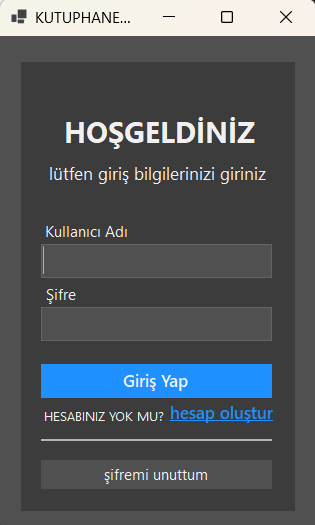
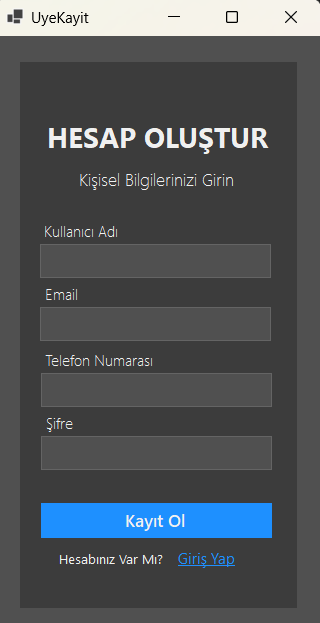
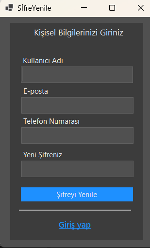
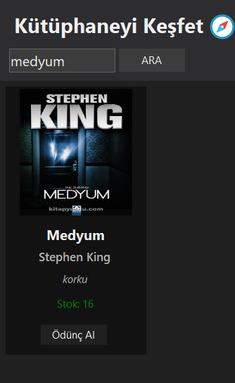
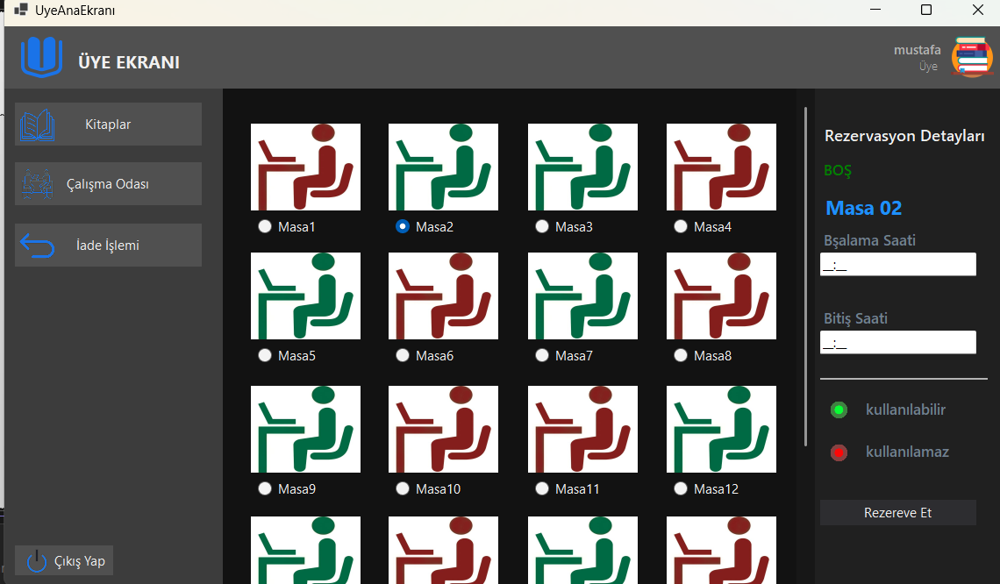
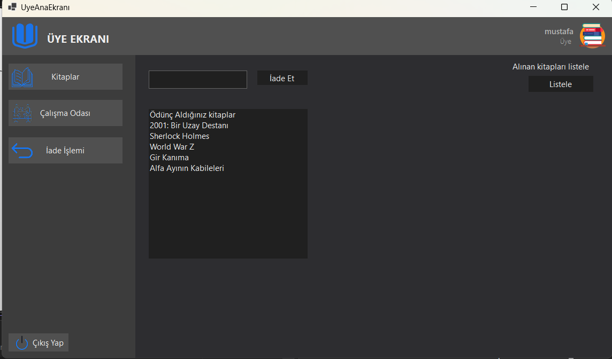
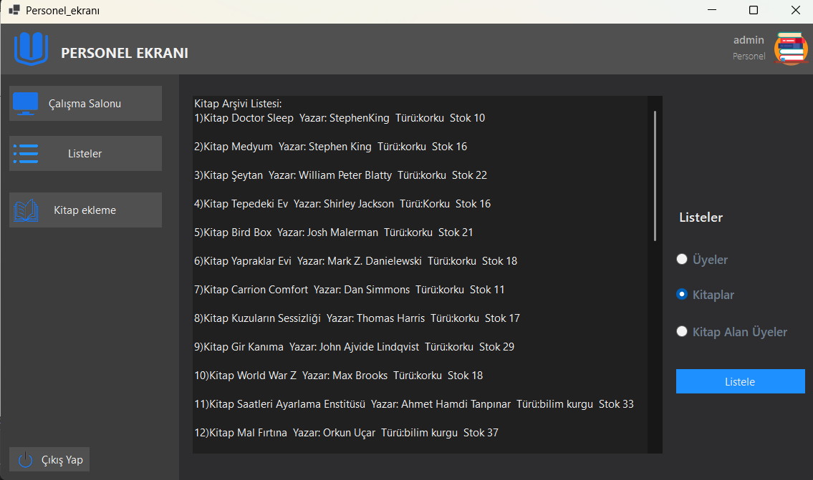
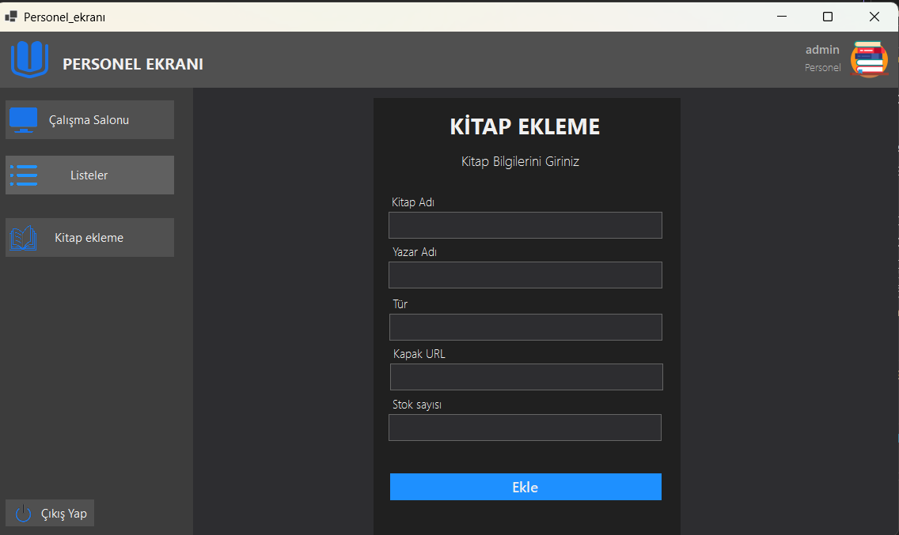
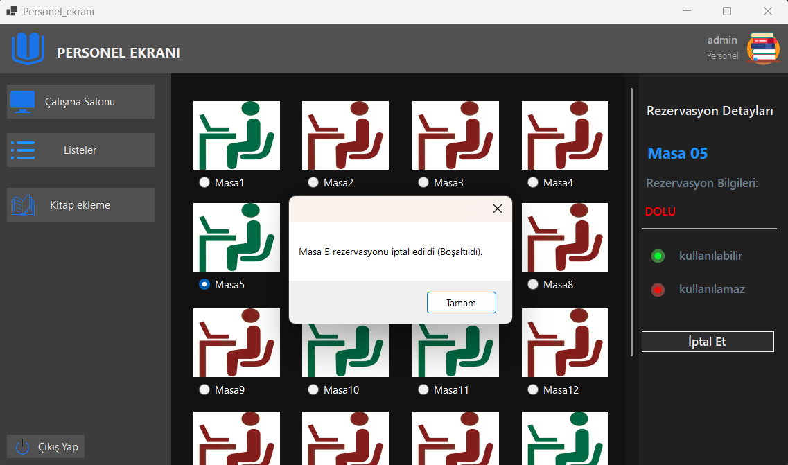

# 📚 LIBRARYPROJECT - Kütüphane Yönetim Sistemi

Bu proje, C# Windows Form kullanılarak geliştirilmiş kapsamlı bir kütüphane yönetim sistemidir.

## ✨ Temel Özellikler
* **Kitap Yönetimi:** Kitap ekleme, silme ve güncelleme işlemleri.
* **Üye İşlemleri:** Kütüphane üyelerinin kaydı ve takibi.
* **Admin Paneli:** Yöneticiye özel yetkilendirilmiş ekranlar.
* **Arama & Filtreleme:** Dinamik arama özellikleri.

## 🛠️ Kullanılan Teknolojiler
* **Dil:** C#
* **Platform:** .NET / Windows Forms
* **Veritabanı:** SQL / Local DB

## 🚀 Kurulum
1. Projeyi klonlayın: `git clone https://github.com/kullanici-adin/LIBRARYPROJECT.git`
2. Visual Studio ile açın.
3. Projeyi derleyin ve çalıştırın.3. Projeyi derleyin ve çalıştırın.
3. Projeyi derleyin ve çalıştırın.

## 📸 Ekran Görüntüleri

### 🔐 Giriş ve Üyelik İşlemleri
Kullanıcı dostu giriş, kayıt ve şifre yenileme ekranları.

| Giriş Ekranı | Kayıt Ol | Şifre Yenileme |
| :---: | :---: | :---: |
|  |  |  |

### 👤 Üye Paneli (Kullanıcı)
Üyeler kitapları inceleyebilir, detaylarını görebilir, çalışma masası rezerve edebilir ve kendi profillerini yönetebilirler.

| Kütüphaneyi Keşfet | Kitap Detay & Arama |
| :---: | :---: |
|  |  |

| Masa Rezervasyon | Profilim & Ödünç Listesi |
| :---: | :---: |
|  |  |

### 🛠️ Personel / Admin Paneli
Yöneticiler için detaylı kitap arşiv listesi, yeni kitap ekleme arayüzü ve çalışma salonu yönetim sistemi.

| Kitap Arşivi | Yeni Kitap Ekleme | Masa Yönetimi |
| :---: | :---: | :---: |
|  |  |  |
